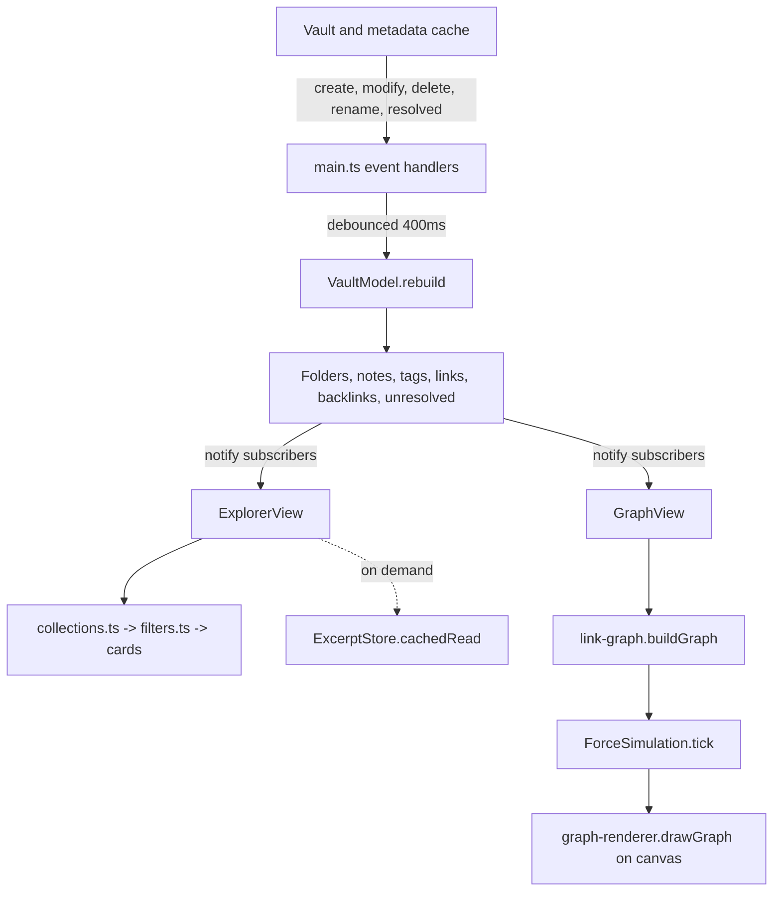

# Architecture

Cerebrum is a plugin lifecycle, one in-memory index, and two views that read it.
`main.ts` does nothing but wiring; every decision about what to show lives in a
module it delegates to.

```
src/
  main.ts                 lifecycle: views, commands, ribbon, event registration
  settings.ts             settings shape, defaults, safe merging of stored data
  constants.ts            view types, icons, debounce and paging constants
  types.ts                the shared vocabulary: NoteEntry, FolderEntry, LinkRef
  core/
    vault-model.ts        the index of folders, notes, tags, links and backlinks
    facets.ts             folder levels: patterns, matching, counting, detection
    link-graph.ts         nodes and edges, local graphs, ghosts, scope filtering
    filters.ts            fuzzy search, sorting, grouping
    excerpts.ts           lazy note previews with a modification-time cache
  ui/
    explorer-view.ts      the browser's ItemView, state and render orchestration
    explorer-header.ts    breadcrumb and toolbar
    explorer-rail.ts      collections, spaces and tags
    explorer-content.ts   cards, rows, folder cards, missing pages, empty states
    collections.ts        turns a selection into a collection to draw
    graph-view.ts         the graph's ItemView: toolbar, canvas, interaction
    graph-renderer.ts     canvas drawing, camera transforms, hit testing
    graph-simulation.ts   the force layout and its Barnes-Hut quadtree
    settings-tab.ts       the settings interface
    file-actions.ts       opening notes, file menus, hover previews
    view-actions.ts       opening and reusing view tabs
  utils/
    format.ts             relative times, counts, path and tag formatting
    icons.ts              file extension to Lucide icon
    palette.ts            stable folder colours from a hash of the folder name
```

## Data flow



## The index

`VaultModel.rebuild()` runs in three passes and then notifies subscribers.

1. **Folders.** Walk `vault.getRoot()` recursively, recording each folder with
   its parent, depth and children. Excluded paths are skipped, along with
   everything below them. This is why folder discovery needs no configuration:
   the folder list *is* the vault's folder list, re-read every time.
2. **Files.** For each file from `vault.getFiles()`, build a `NoteEntry` from
   `metadataCache.getFileCache`: title (frontmatter `title` or the file name),
   summary (`description`, `summary` or `abstract`), tags via `getAllTags`,
   aliases, timestamps, facet values (see below), and whether it is a note
   (`.md` or `.canvas`) or an attachment. Note counts propagate up the folder
   chain; attachments are indexed but not counted.
3. **Links.** For each markdown note, collect `cache.links`, `cache.embeds` and
   `cache.frontmatterLinks`, resolve each through
   `metadataCache.getFirstLinkpathDest`, and record it as a `LinkRef` carrying
   its kind, its resolved state and its target. A resolved reference also
   appends the source path to the target's `incoming` list; an unresolved one is
   collected under the link text it was written as.

Rebuilds are full rather than incremental. Everything the pass reads is already
in Obsidian's memory, so the cost is proportional to file count and no disk I/O
is involved; a 400 ms debounce collapses bursts of events into one pass. Note
bodies are the exception — they are only read for excerpts, lazily, per card.

Attachments are always indexed, and the **Show attachments** setting filters at
the view layer instead. That keeps the graph's own attachment toggle independent
of the browser's.

## Facets

`facets.ts` turns a path into meaning. A pattern such as
`raw/<year>/<subject>/<unit>` names each folder level once; matching a note's
folder segments against it yields `{year, subject, unit}`, which the note then
carries as independent filters.

The matching rules are deliberately forgiving, because a real vault is never
uniform:

- **Deeper than the pattern**: extra segments are ignored, so a folder someone
  nests inside a unit does not knock its notes out of that unit.
- **Shallower than the pattern**: matching stops when the path runs out, and the
  levels never reached are simply absent rather than a failure.
- **A literal that does not match**: the rule fails and the next one is tried.
  A note matching no rule has no levels and stays browsable by folder.
- **Frontmatter**: a key named after a level overrides whatever the path says,
  which is the escape hatch for a note filed in the wrong place.

Facet *counts* are what make the rail feel like a search rather than a tree.
`countValues` counts a facet's values under every active filter **except its
own**, which is what lets a year narrow the subject list while leaving all years
listed so you can switch in one click.

`detectRules` guesses patterns from the vault's own shape, one per top level
tree, naming a level `year` when most of its values look like years. It is
wired to a button rather than run automatically, so the guess lands in an
editable box instead of silently deciding the vault's structure.

## Building the graph

`buildGraph` takes the index and a set of options and returns nodes and edges.

1. **Include** the notes that pass the attachment filter.
2. **Scope** them: in local mode, a breadth-first walk out from the focused note
   to the configured depth, following links in both directions; then any facet
   filters; then the query filter over path, title and tags.
3. **Build** nodes for the scope, then walk each scoped note's outgoing
   references. A reference to a note **outside the scope is skipped**, which is
   what keeps a depth of one at a depth of one and stops a filter from dragging
   neighbours back in. An unresolved reference becomes a ghost node keyed by
   `unresolved:<lowercased text>`, which cannot collide with a vault path.
4. **Finish**: mark reciprocal pairs as mutual, and drop unconnected nodes when
   unlinked notes are turned off.

The node limit is enforced while building; the count of what it dropped is
reported back so the view can say so.

Edges are deduplicated per source, target and kind — so a note linking to
another twice draws one line, but linking *and* embedding draws two, because
those are different relationships.

## Layout

`ForceSimulation` is a small force-directed layout over the node objects
themselves; positions live on the nodes, so a rebuild can carry them over and
the graph shifts rather than jumping.

Each tick applies, in order:

- **Repulsion** through a Barnes-Hut quadtree with θ = 0.9. Cells further away
  than their size allows are treated as a single mass at their centre of mass,
  which is what keeps a few thousand nodes cheap. Subdivision is capped at depth
  22 so coincident points cannot recurse forever.
- **Springs** along each edge, pulling towards the configured link distance.
- **Centering**, a weak pull towards the origin.
- **Integration**: velocities damped by 0.78 and clamped, then applied. Pinned
  nodes have their velocity zeroed and keep the position the drag gave them.

`alpha` starts at 1 and decays by 0.988 per tick; below 0.004 the simulation
reports itself settled and `GraphView` stops requesting frames. Dragging,
changing a force setting or rebuilding reheats it. Nodes are seeded on a
phyllotaxis spiral, which avoids the symmetric collapse a grid produces.

Measured on this implementation: 1,500 nodes and 1,499 edges tick in well under
16 ms, so the layout holds 60 fps while settling.

## Rendering

`graph-renderer.ts` is pure drawing with no Obsidian dependency, which is what
makes it testable outside the app.

- The canvas is sized to `devicePixelRatio` and the context pre-scaled, so text
  and lines stay sharp on high-density screens.
- The camera is `{x, y, scale}`. `toScreen` and `toWorld` convert between
  spaces; zooming converts the cursor to world space before and after the scale
  change and shifts the camera by the difference, which is what makes the zoom
  track the pointer.
- Colours are read from the theme's own CSS variables (`--background-primary`,
  `--text-normal`, `--interactive-accent` and friends) and cached until
  Obsidian's `css-change` event fires, so the graph follows the active theme
  including light and dark switches.
- Hit testing is a linear scan for the nearest node within its radius plus a
  small screen-space margin. At the node counts the limit permits this is
  cheaper than maintaining a spatial index alongside a moving layout.

## Views and state

Both views are `ItemView`s registered in `onload`. Neither is ever stored on the
plugin: when the plugin needs to reach one — a theme change, a new active file —
it iterates `workspace.getLeavesOfType()` and checks `instanceof`, so no
reference can outlive its leaf.

Each view keeps its own state and reports it through `getState`/`setState`, so
the browser's selection and the graph's focus survive a workspace reload and
work with the back and forward arrows.

Render work is debounced by role: 40 ms for a full browser redraw, 120 ms for
results-only redraws while typing, 250 ms for a graph rebuild. The browser
splits header rendering from body rendering specifically so typing in the search
box never re-creates the input under the caret.

Subscriptions are handed out by `VaultModel.subscribe`, which returns its own
unsubscriber; each view calls it in `onClose` alongside disconnecting its resize
observer and cancelling its animation frame.

## Deliberate constraints

- **No dependencies.** Everything ships in `main.js` from `src/`; the only
  runtime import is `obsidian` itself, which the bundle marks external.
- **No `innerHTML`.** All DOM is built through Obsidian's `createEl` helpers.
- **No inline styles.** Dynamic values reach CSS through custom properties set
  with `setCssProps` (`--cerebrum-accent`, `--cerebrum-depth`); everything else
  is a class in `styles.css` built on Obsidian's variables.
- **No node references held across rebuilds** except positions, which are copied
  by id.

These are also what `eslint-plugin-obsidianmd` enforces; see
[contributing](contributing.md).
